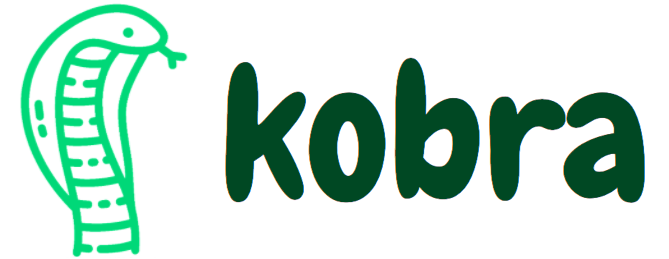

  
  <h1 align="center">Visual programming language for Machine Learning</h1>

<h2>Live Demo :D</h2>
<iframe src="https://mambaml.herokuapp.com" width="100%" height="800px"></iframe>

Local Environment Setup:
Clone the repo:
`git clone https://github.com/pranavnt/Mamba.git`
Install Dependencies:
`npm install dependencies`
Install devDependencies (http-server):
`npm install devDependencies`
Run the start script:
`npm run start`
